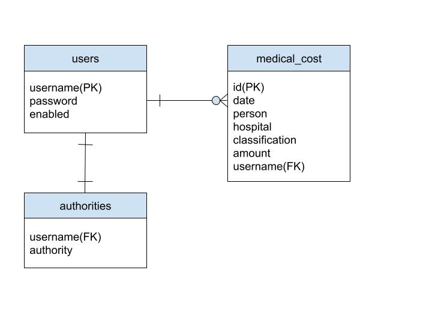

# 医療費控除管理ツール
medical-expenses-deduction-management


## アプリ概要
- 確定申告用に医療費明細を確認できる


## 構成
- Java 17
- SpringBoot 3.x 
- Thymeleaf 3.x 
- Bootstrap 5
- MySQL 8.x


## データベース設計
### テーブル定義書
* 論理名: ユーザー情報
* 物理名: users

| 項番 | カラム論理名 | カラム物理名 | データ型 | Not Null | デフォルト | 主キー | インデックス |
|------|--------------|--------------|----------|----------|------------|--------|--------------|
| 1    | ユーザー名   | username     | VARCHAR  | ◯        |            | PK     |              |
| 2    | パスワード   | password     | VARCHAR  | ◯        |            |        |              |
| 3    | 有効         | enabled      | BOOLEAN  | ◯        |            |        |              |

* 論理名: 権限
* 物理名: authorities

| 項番 | カラム論理名 | カラム物理名 | データ型 | Not Null | デフォルト | 主キー | インデックス |
|------|--------------|--------------|----------|----------|------------|--------|--------------|
| 1    | ユーザー名   | username     | VARCHAR  | ◯        |            | FK     |              |
| 2    | 権限         | authority    | VARCHAR  | ◯        |            |        |              |

* 論理名: 医療費明細情報
* 物理名: medical_cost

| 項番 | カラム論理名 | カラム物理名   | データ型 | Not Null | デフォルト | 主キー | インデックス |
|------|--------------|----------------|----------|----------|------------|--------|--------------|
| 1    | 医療費id     | id             | BIGINT   | ◯        |            | PK     |              |
| 2    | 受診日       | date           | DATE     |          |            |        |              |
| 3    | 受診者       | person         | NVARCHAR | ◯        |            |        |              |
| 4    | 支払先       | hospital       | NVARCHAR | ◯        |            |        |              |
| 5    | 医療費の区分 | classification | NVARCHAR |          |            |        |              |
| 6    | 支払額       | amount         | BIGINT   | ◯        |            |        |              |
| 7    | ユーザ名     | username       | VARCHAR  | ◯        |            | FK     |              |


### ER図



### テストデータ
```mysql
INSERT INTO medical_cost (id, date, person, hospital, classification, amount, username)
VALUES (1, '2023/01/03', '山田太郎', '歯科', '治療', 1000, 1, '山田太郎');
```


